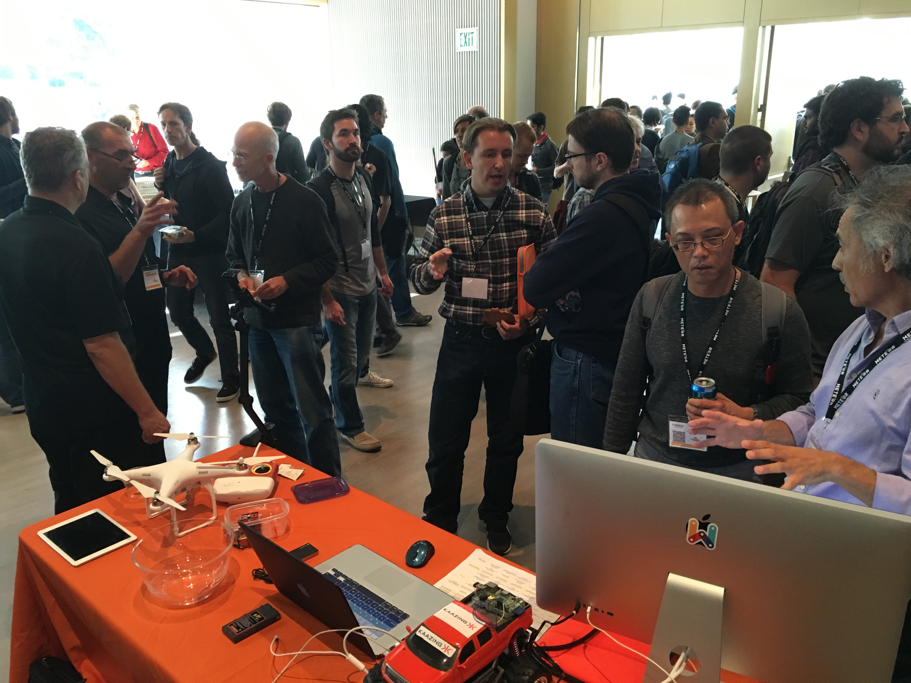

# HTML5 Developer Conference
** Oct 19-20, 2015 - San Francisco, Yerba Buena Center for the Arts **

## Talk

[**WebSocket Perspectives 2015 - Clouds, Streaming, Microservices and the Web of Things**](assets/WS-Clouds-Streaming-Microservices.pdf)
**Speakers:** Frank Greco, Peter Moskovits

**Abstract**
The WebSocket protocol has proven to be a humongous advance for the web by providing a standard full-duplex connection over the web. However most applications of WebSocket merely use it as a push mechanism to send data from the server to the client. As with most innovations, using something new for legacy applications is a common reaction.

WebSocket is effectively a persistent and fat pipe that is compatible with a standard web infrastructure; a "TCP for the Web". If you think of WebSocket in this light, there are other more hugely interesting applications of WebSocket than just simply sending data to a browser.

This session looks at how WebSocket provides truly innovative enhancements for dynamic cloud computing connectivity and microservices transports. And by providing proprietary TCP-based IoT with a common connectable substrate (Web of Things), we can obtain advantages for connected devices such as global reach, ease of deployment, economies of scale, ease of development, etc. In addition, we will demonstrate some novel applications of WebSocket that go well beyond simple push.

## Demos
* [Multi-user ToDo application](http://kaazing.org/demos/todomvc/) using AngularJS and Kaazing WebSocket - based on [ToDo MVC](http://todomvc.com).
* [Quadcopter telemetry](http://developer.kaazing.com/portfolio/telemetry/) transfer over satellite connection
* [Controlling truck](https://vimeo.com/63023206) over the Web in real time
* [Kaazing WebSocket Intercloud Connect](http://kaazing.com/kwic) (KWIC)

